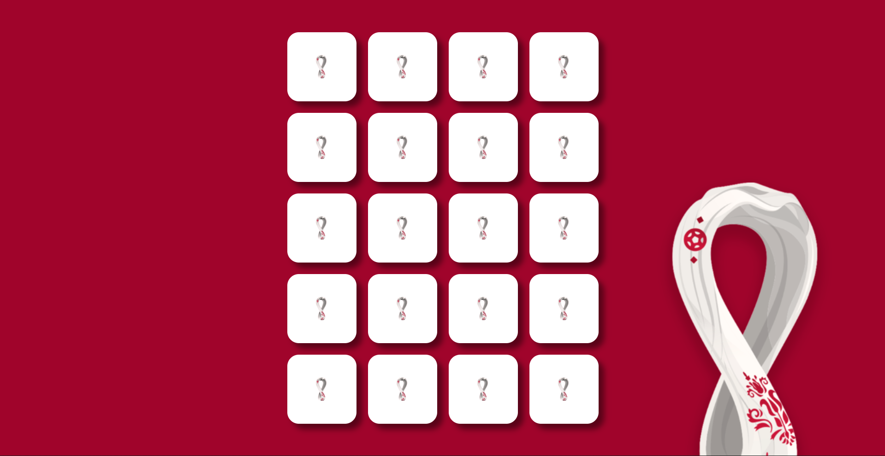
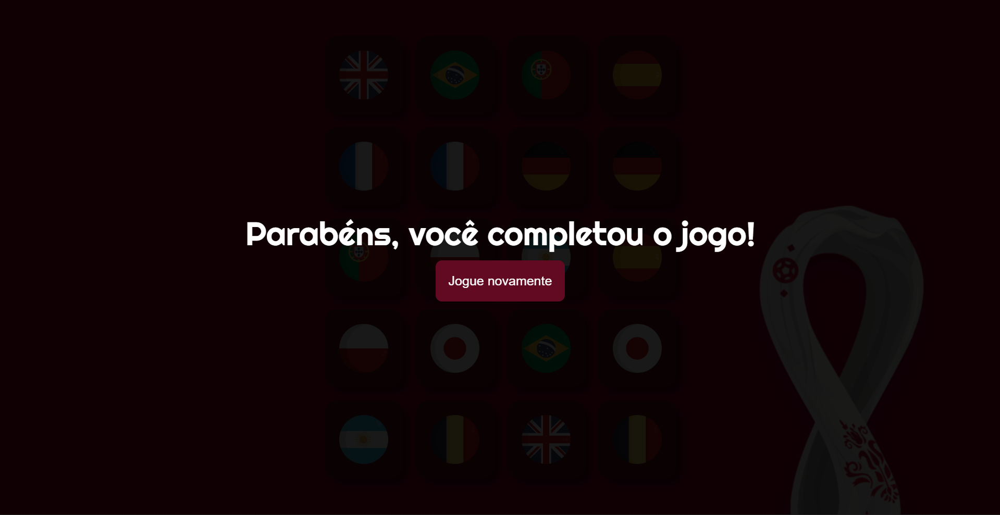

<h1 align="center">Memory Game 🃏</h1>

🔥 O clássico jogo da memória! Uma ótima aplicação que melhora seu tempo de memória!

 <a href="#-tecnologias">Tecnologias</a> •
 <a href="#-projeto">Projeto</a> • 
 <a href="#-objetivo">Objetivo</a> • 
  <a href="#-roadmap">Roadmap</a>

 

## 💻 Version Web

 

  

    
    
  

 

Teste você mesmo!!🔎 https://maarcusvinicius.github.io/MemoryGame/

 

## 🔧 Tecnologias

Esse projeto foi desenvolvido com as seguintes tecnologias:

- [HTML](https://developer.mozilla.org/pt-BR/docs/Web/HTML)
- [CSS](https://developer.mozilla.org/pt-BR/docs/Web/CSS)
- [JavaScript](https://developer.mozilla.org/pt-BR/docs/Web/JavaScript)

 

## 💻 Projeto

O Memory Game é um projeto que simula um jogo da memória via Web, onde é possível ganhar com animação, e reiniciar o jogo. Utilizei como imagens, as tecnologias que já estudei!

 

## ✅ Objetivo

Utilizei as tecnologias mais PURAS para mostrar certa habilidade, mas ainda quero me aprofundar mais em Javascript para aprimoração de DOM para futuros projetos, acessível e de fácil compreensão!!

 

## 🏍️ Roadmap

 

    - [x] Criar HTML

    - [x] Criar CSS

    - [x] Criar Javascript

    - [x] Deploy Vercel

 

<h4 align="center"> 
	🚧  Memory Game 🃏 FINALIZADO 🚧
</h4>
 

 

Feito com ❤️ por Marcus Vinicius 👋🏽 Entre em contato!

//feito readme marcus 

### Olá, sou Marcus 

Sou Desenvolvedor Web, um programador procurando fazer a diferença no mundo digital. [**Profile Github**](https://github.com/maarcusvinicius). 🚀

#### Minhas ferramentas atuais
📲 Front-end Mobile com React Native  
🌎 Front-end Web com Reactjs  
📡 Back-end com Nodejs  
🛠️ Typescript  
🧰 And more...  

#### 💬 Encontre-me em outro lugar

